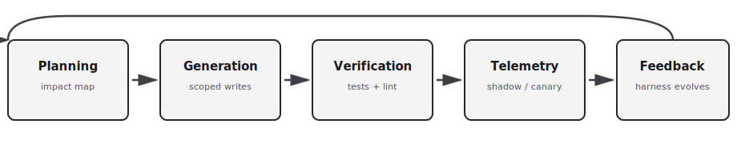

<!-- _class: lead -->

# AI harness for **ddev**

Observable, measurable AI-assisted contributions — **ddev already uses AI in dev and review**; this is about harnessing it **consistently**

---

## Agenda

- Reality & goal — **AI is already in the loop** (dev + review); gaps are provenance, measurement, parity across tools.
- **What’s already in ddev** — `AGENTS.md`, `make staticrequired`, CI — vs gaps.
- **Harness-first** — plan → generate → verify → telemetry → feedback.
- Options, building blocks, environments, **metrics**.
- CI gates, variability, governance, **incremental deliverables**.
- References & **maintainer CTA**.

---

## Why now

- **DDEV already practices AI-assisted development and review** — agents and copilots draft code, docs, and review commentary; humans still merge with judgment.
- Contributors and tools vary (**Claude Code, Codex, Cursor, Copilot**, etc.) — **no shared provenance** for what produced a given change.
- **Black-box models** drift day to day; identical prompts can yield different results — hard to debug or compare runs.
- The next step is not “turn on AI” but **standards, verification, and telemetry** that make that reality **consistent, observable, and measurable** for **every PR**.

---

## Goal

ddev **already** ships AI-assisted changes; make that practice:

- **Consistent** — same gates and artifacts for every PR.
- **Observable** — unified telemetry across local, CI, staging, and shadow runs.
- **Measurable** — KPIs and time series, not vibes.

Automation and monitoring so model-driven changes stay **safe, reproducible, and auditable**.

---

## What’s already in ddev — **foundation**

Reuse this **harness v0** — AI-assisted workflow is **already normalized** in-repo.

- **[`AGENTS.md`](https://github.com/ddev/ddev/blob/main/AGENTS.md)** + **[Copilot instructions](https://github.com/ddev/ddev/blob/main/.github/copilot-instructions.md)** — playbook for dev **and** review assistance.
- **[`CLAUDE.md`](https://github.com/ddev/ddev/blob/main/CLAUDE.md)** + **`.claude/`** — pre-commit `make staticrequired`; format hooks for Go/Markdown.
- **`make staticrequired`** — golangci-lint, markdown, mkdocs, spelling.
- **CI** — build, docs checks, integration tests (many workflows).
- **PR template** + **[`.mcp.json`](https://github.com/ddev/ddev/blob/main/.mcp.json)** (`ddev-specs`).

---

## What’s already in ddev — **gaps**

**Not there yet (this proposal):**

- Machine-readable **agent fingerprint**
- **Impact map** / plan-vs-diff gate
- **Harness score** rollup
- **Unified telemetry** across agent runs

**Tooling parity:** docs and hooks skew **Claude**; **Cursor / Codex** are lighter — one harness should serve all.

---

## Harness-first (high level)

**Constrain and instrument** the workflow so agents can explore, while the **harness proves correctness**.

Tight feedback loops: fast local checks, strict CI, shadow/canary signal, then feed results back into prompts and rules.

**In ddev terms:** treat **`make staticrequired` + existing CI** as the verified core; add **provenance, planning artifacts, and scoring** around it — not a second quality system.

---

## Candidate approaches (overview)

| Approach | Scope | Strengths | Weaknesses | Best for |
|----------|-------|-----------|------------|----------|
| **Harness-first** | Repo + CI + runtime | Fast automated verification; tight loops | Upfront engineering + telemetry | Large-scale agent-driven change |
| **Impact map + gated plan** | Planning only | Catches structural mistakes early; human checkpoint | Needs repo scanning + map tooling | Feature planning / scoping |
| **Reference / community harnesses** | Reusable parts | Best practices; faster adoption | Adaptation to ddev | Bootstrapping primitives |

**Stance:** combine — **plan gates** + **verification harness** + **reuse** where it fits.

---

## Core components (1/2) — observable & measurable

**Agent registry & fingerprinting** — provider, model id, prompt/toolchain snapshot → machine-readable PR header; trend by model.

**Structured task spec** — short machine-readable **repository impact map** before generation (files, APIs, tests).

**Generation harness** — isolated runs: repo snapshot, LSP/MCP where allowed, **strict write scopes** → track out-of-scope edits and “hallucination” paths.

---

## Core components (2/2)

**Automated verification suite** — static analysis, units, **structural/layering** rules, security linters, behavioral/golden tests, property checks.

**Shadow / canary + observability** — integration + canary with logs, metrics, traces; compare to baseline.

**Feedback loop & harness evolution** — verification + telemetry **updates prompts, constraints, tests**.

**Audit trail & provenance** — fingerprint → plan → diff → verification → deploy telemetry (**immutable** story per change).

---

## Test environments (recommended stack)

| Layer | Role |
|-------|------|
| **Local dev harness** | Fast, deterministic — **today:** `make staticrequired` + hooks; optional: stricter agent-local gates |
| **CI harness** | Gated PRs: impact map validation, static + unit/integration + structural |
| **Staging shadow** | Representative workloads + telemetry |
| **Canary / shadow production** | Feature flags / shadow traffic — non-user-impact validation |
| **Replay sandbox** | Deterministic replay of failing traces |

**Requirement:** standardized events/metrics to a **central observability store** so runs compare across machines and models.

---

## Metrics to track (examples)

- **Agent provenance coverage** — % of PRs with agent metadata.
- **Plan–change fidelity** — impact map vs final diff.
- **Verification pass rate** — first-run green for agent PRs.
- **Median human review time** — per AI-generated PR.
- **Hallucination incidents** — invented APIs/paths (count / PR).
- **Regression delta** — error rate & latency vs baseline in shadow.
- **Model variance index** — day-over-day spread for same prompt + snapshot.
- **Harness tightness** — rule/prompt updates vs pass-rate movement.

Time series + **alert thresholds** on regressions.

---

## CI — **pre-merge**

**Already there:** `pr-check.yml` (title, labels) + workflows for **build, lint, docs, tests** — deep verification.

**Optional adds** (maintainer buy-in):

- **Agent metadata** (schema in RFC / `AGENTS.md`)
- **Impact map** check (scanner + diff match)
- **Harness score** — rollup from *existing* checks; merge bar TBD

**Bar unchanged:** formatters, linters, unit/integration tests stay as today.

---

## CI — **post-merge**

- **Staging shadow** — integration runs on merged changes.
- **Canary** — telemetry gates; **auto-rollback** if thresholds fail.

---

## Model & product variability

- **Pin context** — commit hash, prompt template id, toolchain in metadata → reproducibility.
- **Seeded experiments** — N parallel generations; pick best by harness score when nondeterministic.
- **Shadow evaluation** — run multiple agents/models in parallel; surface diffs to reviewers.
- **Drift monitoring** — model variance index; alerts tie to stricter rules or rollback.

We **don’t** need one vendor — we need **one harness** that works across them.

---

## Governance — **docs & template**

- **[`AGENTS.md`](https://github.com/ddev/ddev/blob/main/AGENTS.md)** — add: metadata schema, impact map, how to read **harness score**. Align with **[org policy](https://github.com/ddev/.github/blob/main/AGENTS.md)** where useful.
- **PR template** — optional: tool fingerprint, plan artifact link, score (when CI prints it).

---

## Governance — **review & everyone else**

- **Allowlist** — approved tools/models; CI **blocking** strays = **TBD** with maintainers.
- **Reviewers** — check provenance, plan vs diff, shadow (when on).
- **Playbook** — `make staticrequired`, read CI, where metadata lives (`AGENTS.md` or docs).
- **Non-agent PRs** — same CI; mark **manual** in metadata.

---

## Low-effort steps — **1–3**

1. **Issue** — “AI harness: proposal + checklist”; gather owners + constraints.
2. **Extend** `AGENTS.md` + PR template — `AGENT_METADATA` (or equiv.) + impact map hook; keep current playbook.
3. **CI prototype** — optional metadata validation + **simple score** from existing lint/test jobs.

---

## Low-effort steps — **4–5**

4. **Repo scanner** — impact map artifact per PR/issue (human + bot).
5. **Pilot** — ~2 weeks, safe area; track metrics; fix **Cursor/Codex** doc gaps if needed.

Lean on **community harness patterns** (see References) + **`make staticrequired`**.

---

## Deliverables (priority order)

1. **Issue + RFC** — harness policy, metrics, rollout (this deck as starting body).
2. **PR template + `AGENTS.md` extensions** — provenance + planning sections; **Copilot** already follows `AGENTS.md`.
3. **CI incremental** — optional metadata validation + **harness score v0** (mostly aggregation over **existing** checks).
4. **Repo scanner prototype** — impact maps for humans + tooling.
5. **Shadow-run pipeline** — staging + telemetry (phase 2 if maintainers want lighter v1).

---

## References

- [Observability-driven harnesses — Datadog](https://www.datadoghq.com/blog/ai/harness-first-agents/)
- [Harness engineering (Codex) — OpenAI](https://openai.com/index/harness-engineering/)
- [Structured workflows — Red Hat Developer](https://developers.redhat.com/articles/2026/04/07/harness-engineering-structured-workflows-ai-assisted-development)
- [awesome-harness-engineering — walkinglabs](https://github.com/walkinglabs/awesome-harness-engineering)

---

<!-- _class: lead -->

## Call to action

**Open a maintainer thread:** RFC + tracking issue — align on scope (“metadata only” vs full shadow stack), owners, and **measurement / pilot** boundaries for the harness **on top of** current AI-assisted practice.

Offer optional follow-ups: pasted **RFC body**, **PR template**, and **AGENT_METADATA** schema for GitHub.

---

## Summary

- **Harness-first** = provenance + structured plan + scoped generation + automated verification + telemetry + feedback into rules.
- **AI-assisted dev and review are already normal** in ddev; the harness makes that **legible** (who/what/when) and **governable** without slowing humans down.
- **ddev already has** verification muscle (`staticrequired`, rich CI); the win is **metadata, planning artifacts, measurability, and cross-tool parity** — not a parallel QA stack.
- **Phase thoughtfully:** RFC → extend **existing** `AGENTS.md` + PR template → optional CI score + scanner → shadow/canary when ready.
- **Presenter hint:** OSS can’t mandate one IDE — **CI and artifacts** are the shared contract; reconcile **Go version** and other agent-facing hints in `AGENTS.md` so generated PRs don’t drift.
